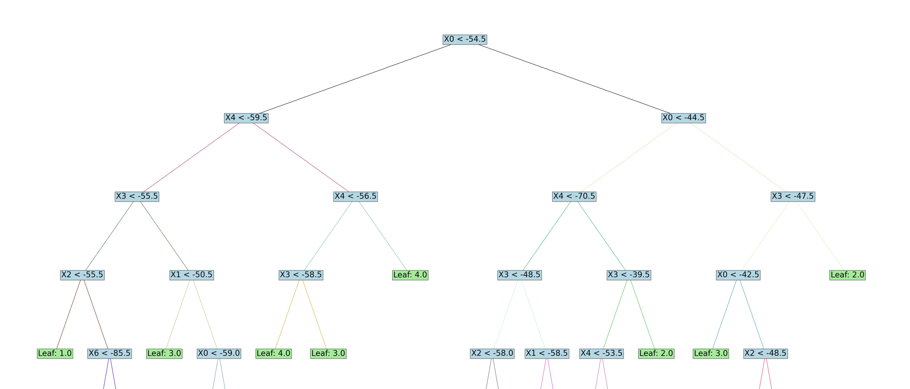

# Decision Tree ML Report

## Introduction
This report presents the results of a Decision Tree algorithm implementation, aimed at classifying indoor locations based on WiFi signal strengths. The decision tree was built to handle continuous data attributes and multiple labels, following guidelines provided in the coursework.

## Step 1: Loading Data
Data was loaded from `wifi_db/clean_dataset.txt` and `wifi_db/noisy_dataset.txt`, each containing 2000 samples. Each sample includes seven WiFi signal strengths, with a label indicating the room number.

> _Load instructions are included in the README.md._

## Step 2: Decision Tree Creation
A recursive function `decision_tree_learning()` was developed to construct the decision tree. It utilizes information gain for optimal attribute splitting and handles continuous values by searching for the best split point.

### Tree Visualization
Below is the complete visualization of the tree trained on the clean dataset.

Since the depth of our decision tree is large, the complete visualization shown above may lack clarity. To improve readability, the top levels of the tree are also displayed below:

## Step 3: Evaluation

### Cross-Validation Classification Metrics
A 10-fold cross-validation was conducted on both the clean and noisy datasets. The following metrics were computed:

For **clean datasets**:
- **Confusion Matrix**  
  |       | Predicted Room 1  | Predicted Room 2 | Predicted Room 3 | Predicted Room 4 |
  |-------|-------------------|------------------|------------------|------------------|
  | Room 1| 49.4              | 0.               | 0.2              | 0.4              |
  | Room 2| 0.                | 47.6             | 2.4              | 0.               |
  | Room 3| 0.5               | 1.7              | 47.6             | 0.2              |
  | Room 4| 0.4               | 0.               | 0.2              | 49.4             |

- **Accuracy**: 0.97
- **Class labels**: [1. 2. 3. 4.]
- **Average recall for each class**: [0.98840876 0.952233   0.95248136 0.98773702]
- **Average precision for each class**: [0.98195881 0.96587966 0.94506849 0.9872858]
- **Average F1-measure for each class**: [0.98503266 0.95883303 0.94858487 0.98735266]

For **noisy datasets**:
- **Confusion Matrix**  
  |       | Predicted Room 1  | Predicted Room 2 | Predicted Room 3 | Predicted Room 4 |
  |-------|-------------------|------------------|------------------|------------------|
  | Room 1| 39.2              | 2.5              | 3.4              | 3.9              |
  | Room 2| 2.9               | 41.              | 3.4              | 2.4              |
  | Room 3| 3.                | 3.3              | 42.4             | 2.8              |
  | Room 4| 3.2               | 2.4              | 3.               | 41.2             |

- **Accuracy**: 0.819
- **Class labels**: [1. 2. 3. 4.]
- **Average recall for each class**: [0.80373177 0.82266353 0.82165509 0.83542975]
- **Average precision for each class**: [0.81178536 0.83360411 0.81589391 0.82077863]
- **Average F1-measure for each class**: [0.80617139 0.82532958 0.81709598 0.82499199]

### Result Analysis
The decision tree performed well on the clean dataset, with high accuracy for all rooms, especially Rooms 1 and 4, 
showing minimal misclassification. In the noisy dataset, 
accuracy dropped as signal overlaps caused more misclassifications, mainly between Rooms 1 & 2 and Rooms 3 & 4. 
This suggests noise weakened the model’s boundary precision.

### Dataset Differences
The clean dataset’s accuracy was high (97%), 
while noise reduced it to 81.9%. Noise likely caused signal overlap, making it harder to find effective splits, 
especially for adjacent rooms. This impacted the tree’s ability to separate classes clearly, 
increasing errors across all metrics.

## Conclusion
The decision tree model achieved high accuracy on the clean dataset, with performance challenges on the noisy dataset. 
Future improvements could focus on implementing pruning methods to reduce overfitting 
and possibly integrating noise reduction preprocessing steps to enhance classification accuracy in noisy environments.

