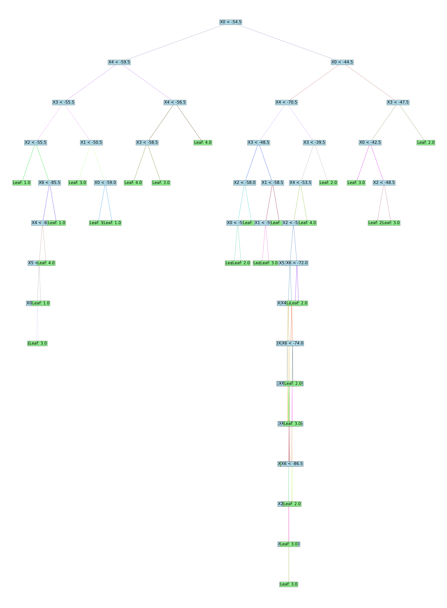

# Decision Tree Coursework Report

## Introduction
This report presents the results of our decision tree algorithm, which predicts the room number based on Wi-Fi signal
strengths. The decision tree was built to handle continuous attributes and multiple labels, following guidelines
provided in the coursework specification.

## Decision Tree Visualisation
Below is the complete visualisation of the tree trained on the entire clean dataset (see next page).

Since the depth of the decision tree is large, the cropped version of the tree is displayed below:

## Step 3: Evaluation

### Cross-Validation Classification Metrics
A 10-fold cross-validation was conducted on both the clean and noisy datasets.\
The following averaged metrics were computed:

For **clean datasets**:
- **Averaged Confusion Matrix**:
  |        | Predicted Room 1  | Predicted Room 2 | Predicted Room 3 | Predicted Room 4 |
  |--------|-------------------|------------------|------------------|------------------|
  | Room 1 | 49.4              | 0.               | 0.2              | 0.4              |
  | Room 2 | 0.                | 47.6             | 2.4              | 0.               |
  | Room 3 | 0.5               | 1.7              | 47.6             | 0.2              |
  | Room 4 | 0.4               | 0.               | 0.2              | 49.4             |

- **Averaged Accuracy**:\
  0.97
- **Averaged recall for each room**:
  |        | Average Recall |
  |--------|----------------|
  | Room 1 | 0.98840876     |
  | Room 2 | 0.952233       |
  | Room 3 | 0.95248136     |
  | Room 4 | 0.98773702     |
- **Averaged precision for each room**:
  |        | Average precision |
  |--------|-------------------|
  | Room 1 | 0.98195881        |
  | Room 2 | 0.96587966        |
  | Room 3 | 0.94506849        |
  | Room 4 | 0.9872858         |
- **Averaged F1-measure for each room**:
  |        | Average F1-measure |
  |--------|--------------------|
  | Room 1 | 0.98503266         |
  | Room 2 | 0.95883303         |
  | Room 3 | 0.94858487         |
  | Room 4 | 0.98735266         |

For **noisy datasets**:
- **Averaged Confusion Matrix**:
  |        | Predicted Room 1  | Predicted Room 2 | Predicted Room 3 | Predicted Room 4 |
  |--------|-------------------|------------------|------------------|------------------|
  | Room 1 | 39.2              | 2.5              | 3.4              | 3.9              |
  | Room 2 | 2.9               | 41.              | 3.4              | 2.4              |
  | Room 3 | 3.                | 3.3              | 42.4             | 2.8              |
  | Room 4 | 3.2               | 2.4              | 3.               | 41.2             |

- **Averaged Accuracy**:\
  0.819
- **Averaged recall for each room**:
  |        | Average Recall |
  |--------|----------------|
  | Room 1 | 0.80373177     |
  | Room 2 | 0.82266353     |
  | Room 3 | 0.82165509     |
  | Room 4 | 0.83542975     |
- **Averaged precision for each room**:
  |        | Average precision |
  |--------|-------------------|
  | Room 1 | 0.81178536        |
  | Room 2 | 0.83360411        |
  | Room 3 | 0.81589391        |
  | Room 4 | 0.82077863        |
- **Averaged F1-measure for each room**:
  |        | Average F1-measure |
  |--------|--------------------|
  | Room 1 | 0.80617139         |
  | Room 2 | 0.82532958         |
  | Room 3 | 0.81709598         |
  | Room 4 | 0.82499199         |

### Result Analysis
In the clean dataset, all rooms are recognized with high accuracy,
particularly Room 1 and Room 4, which show the least confusion with other rooms.
Minor confusion appears between Rooms 2 and 3, but it does not significantly impact the overall accuracy.
In the noisy dataset, there is greater confusion across all rooms.
Accuracy dropped as signal overlaps caused more misclassifications,
mainly between Rooms 1 & 4 and Rooms 2 & 3.
This suggests noise weakened the model’s boundary precision.

### Dataset Differences
Yes, there is a noticeable difference in performance between the clean and noisy datasets.
The clean dataset’s accuracy was high (97%), 
while noisy dataset's accuracy reduced to 81.9%.
Noise likely impacts classifier accuracy by introducing ambiguity in feature values,
leading to increased misclassifications across all rooms (especially for adjacent rooms).
This also results in a decrease in recalls, precisions, and F1-measures.
Noise impacted the tree’s ability to separate classes clearly, increasing errors across all metrics.

## Conclusion
The decision tree algorithm achieved high accuracy on the clean dataset,
with performance challenges on the noisy dataset.
Future improvements could focus on implementing pruning methods to reduce overfitting
and possibly integrating noise reduction preprocessing steps
to enhance classification accuracy in noisy environments.
